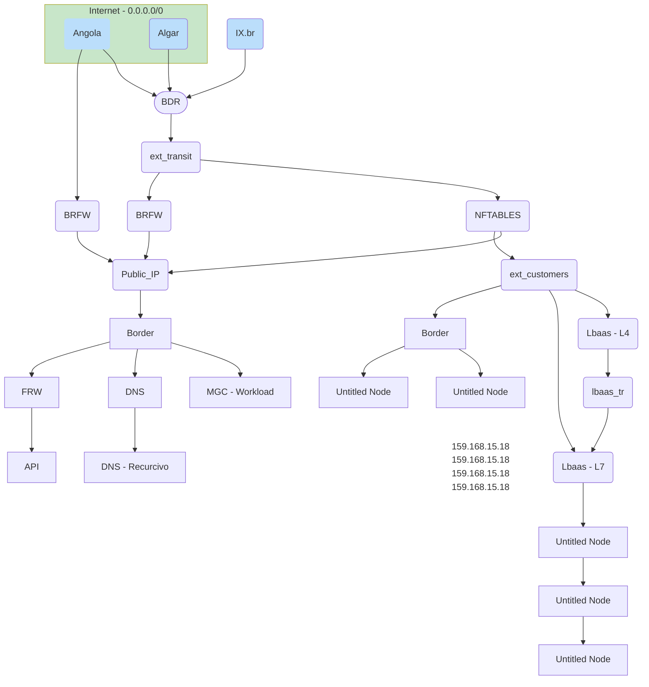
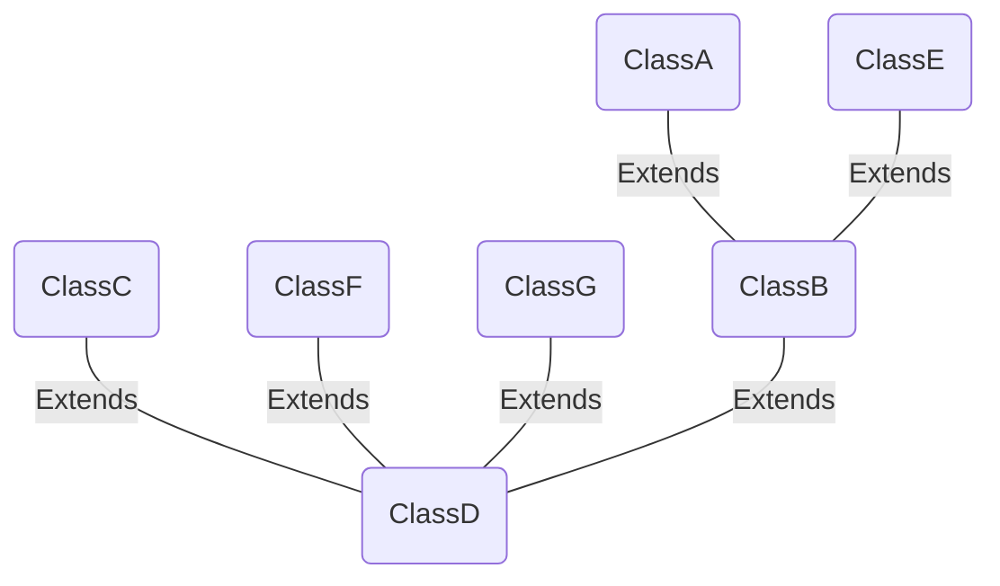
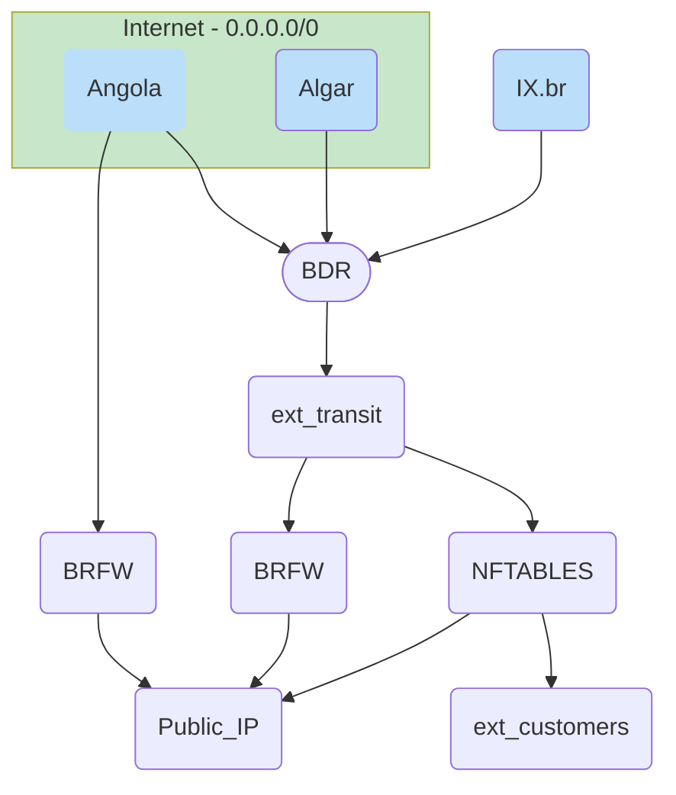

<!-- - Begin: importing scripts -->
<!--  -->
<!--- End: importing scripts -->

<!-- IMPORT LAST VERSION https://www.jsdelivr.com/package/npm/mermaid -->
<!--  -->

## 1 Graph Example

#### Block Graph

<!-- %%{
  init: {
    'theme': 'base',
    'themeVariables': {
      'primaryColor': '#BB2528',
      'primaryTextColor': '#fff',
      'primaryBorderColor': '#7C0000',
      'lineColor': '#F8B229',
      'secondaryColor': '#006100',
      'tertiaryColor': '#fff'
    }
  }
}%% -->

#### Relationship Flow

