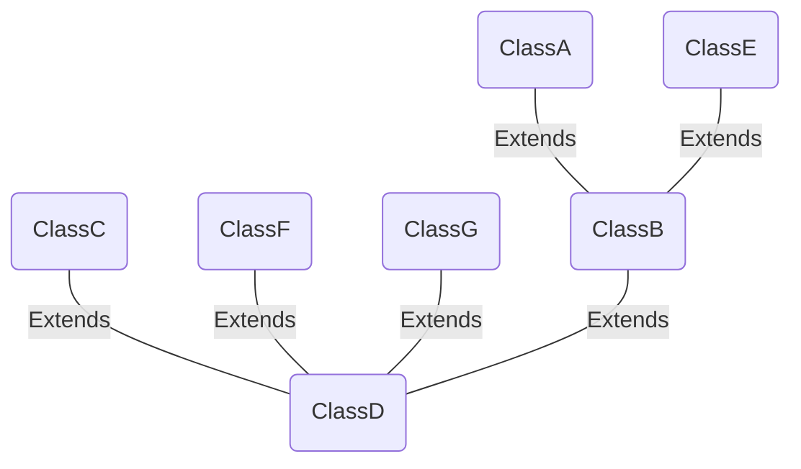

<!-- - Begin: importing scripts -->
<!--  -->
<!--- End: importing scripts -->

<!-- IMPORT LAST VERSION https://www.jsdelivr.com/package/npm/mermaid -->

## 1 Mermaid Example

#### Block Graph

block-beta
      columns 15
        space:5
        ix:5
        space:5

        block:row2("Internet - 0.0.0.0/0"):15
            internet1
            space
            internet2
        end

        space:6
        bdr:3
        space:6

        space:3
        ext_transit:8
        space:4

        bfw1:2
        space
        bfw2:2
        space
        nftables:5
        space:4

        space:12
        lbass_l4:2
        space
        public_ip:5
        space
        ext_customers:5
        space
        ne1_lbaas_rt:2
        space

        space:12
        lbass_l7:2
        space

        border1:5
        space
        border2:5
        space
        ne1_swift:2
        space
        
        fwr:1
        space
        dns
        space
        mgc
        space
        mgc_pprod:2
        space
        mgc_prod:2
        space
        berder3:2

ix --- bdr
internet1 --- bdr
internet2 ---bdr
bdr --- ext_transit
ext_transit --- nftables
ext_transit --- bfw2
internet1 --- bfw1
bfw1 --- public_ip
bfw2 --- public_ip
public_ip --- border1
border1 --- fwr
border1 --- dns
border1 --- mgc        

#### Relationship Flow

